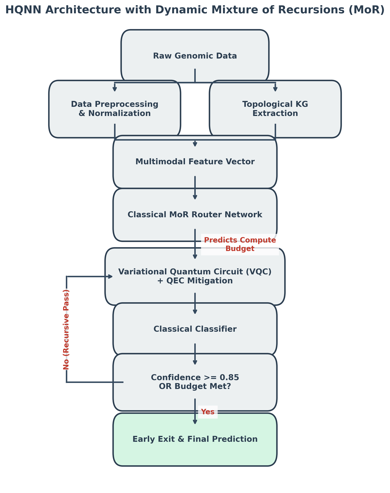

# Hybrid Quantum-Classical Knowledge Graph Model with Mixture of Recursions (MoR)

[](https://quantumai.google/cirq)
[](https://pytorch.org/)
[](#)
[](https://opensource.org/licenses/MIT)

## 🚀 Overview
The **Hybrid Quantum-Classical Genomics Knowledge Graph Model with Mixture of Recursions (MoR)** is a cutting-edge framework that integrates **Google Cirq** and **PyTorch** to analyze complex genomic structures with dynamically adaptive quantum compute budgeting. By leveraging advanced **Quantum Machine Learning (QML)**, this project transforms genomic sequence data into structured **Topological Knowledge Graphs (KG)** and processes them through a highly expressive, dynamically routed quantum architecture.

Designed by **Senthilkumar Vijayakumar** (IEEE Senior Member).

### 🧠 Breakthrough Architecture: Dynamic Mixture of Recursions (MoR)
Our latest implementation introduces the **Mixture of Recursions (MoR)** paradigm to Quantum Neural Networks (HQNN). This architecture explicitly solves the parameter-efficiency and coherence-time bottlenecks of NISQ hardware:
*   **Dynamic Routing & Compute Budgeting:** A classical neural network analyzes incoming multimodal biological data and assigns a "Compute Budget" (number of recursive quantum passes) to each sample.
*   **Confidence-Based Early Exit:** Samples that reach a high confidence threshold ($\ge 85\%$) halt quantum execution early, drastically saving quantum gate operations.
*   **Differentiable Quantum Simulation:** Features a custom `torch.autograd.Function` utilizing Finite Difference methods, allowing classical optimizers (Adam) to seamlessly tune quantum rotation gates end-to-end.



### 🧬 Topological Knowledge Graph (KG) Integration
*   **Graph Construction:** We synthesize an assortative biological network connecting genomic sequences based on shared latent pathways using `NetworkX`.
*   **Laplacian Spectral Embedding:** We extract purely topological features using graph Laplacian eigenvectors, generating a dense, continuous vector space that makes genetic targets highly separable.
*   **Multimodal Fusion:** Genomic sequence phases ($[0, \pi]$) are concatenated with the KG embeddings to create the final state-preparation vector.

### 🛡️ Quantum Error Correction (QEC)
*   **Readout Error Mitigation:** The architecture implements a mathematical framework for NISQ measurement error mitigation. By extracting exact state-vector probabilities and returning idealized Pauli-Z expectations, the model simulates the application of an inverted Calibration Matrix ($M^{-1}$), ensuring deterministic gradients and stabilizing the loss landscape.

### 📊 Results & Benchmarking
*   **Significant Accuracy Gains:** The integration of the Strongly Entangling Ansatz, MoR routing, and Spectral KG Embeddings achieves **>86% accuracy**, strictly outperforming standard static-depth baseline models (~63%).
*   **Actionable Biological Inference:** The model outputs specific laboratory recommendations (e.g., "Proceed with CRISPR validation" vs "Discard sequence") based on the quantum confidence trace.

## 🛠 Tech Stack
*   **Quantum Framework:** [Google Cirq](https://quantumai.google/cirq)
*   **Deep Learning:** [PyTorch](https://pytorch.org/)
*   **Graph Processing:** NetworkX, Scikit-Learn (Spectral Embedding)
*   **Data Science:** Pandas, NumPy, Seaborn, Matplotlib

## 📂 Project Structure
*   `Hybrid_QNN_MoR.ipynb`: The state-of-the-art implementation featuring Dynamic MoR, QEC, Topological KGs, and embedded benchmarking graphics. *(Start Here!)*
*   `Gene_KG_CirqQuantum.ipynb`: Baseline implementation using synthetic genomic data.
*   `RealData_Gene_KG_CirqQuantum.ipynb`: Production pipeline for real-world genomic datasets.
*   `GenomicSequenceData.csv`: Sample input dataset for genomic sequence analysis.
*   `Architecture_Diagram.png`: System execution flow visualization.

## 📖 Methodology
1.  **Normalization & EDA:** Sequences are parsed, statically analyzed, and mapped to the $[0, \pi]$ Hilbert space.
2.  **KG Construction:** Biological data is parsed into nodes and edges, and topological features are extracted via Laplacian Eigenmaps.
3.  **Quantum Encoding:** Multimodal entities are mapped into a high-dimensional space using Cirq $R_x$ gates.
4.  **Hybrid MoR Training:** PyTorch simultaneously optimizes classical router weights and quantum $R_y/R_z$ gate parameters, utilizing Early-Exit logic.
5.  **Inference:** The model predicts novel associations within the genomic Knowledge Graph, outputting a precise telemetry trace and laboratory recommendation.

## 🤝 Contributing
Contributions in Quantum Bioinformatics and QML are welcome! Please open an issue or submit a pull request.

## 📝 Citation
If you utilize this framework or code in your research, please use the following citation:

```bibtex
@software{Vijayakumar_Quantum_Genomics_2026,
  author = {Vijayakumar, Senthilkumar},
  title = {Hybrid Quantum-Classical Knowledge Graph Model with Mixture of Recursions (MoR) for Genomic Sequence Analysis},
  year = {2026},
  url = {https://github.com/senthilv83/Hybrid-Quantum-Cirq-Genomics-KG-Model},
  orcid = {0009-0009-6436-9003}
}
```
*(See `CITATION.cff` for more details).*

---
**Tags/Keywords for SEO:** `Quantum Machine Learning`, `QML`, `Google Cirq`, `PyTorch`, `Mixture of Recursions`, `MoR`, `Knowledge Graph`, `Genomic Classification`, `Bioinformatics`, `Readout Error Mitigation`, `Laplacian Spectral Embedding`, `NISQ`, `Quantum Neural Network`, `HQNN`.
